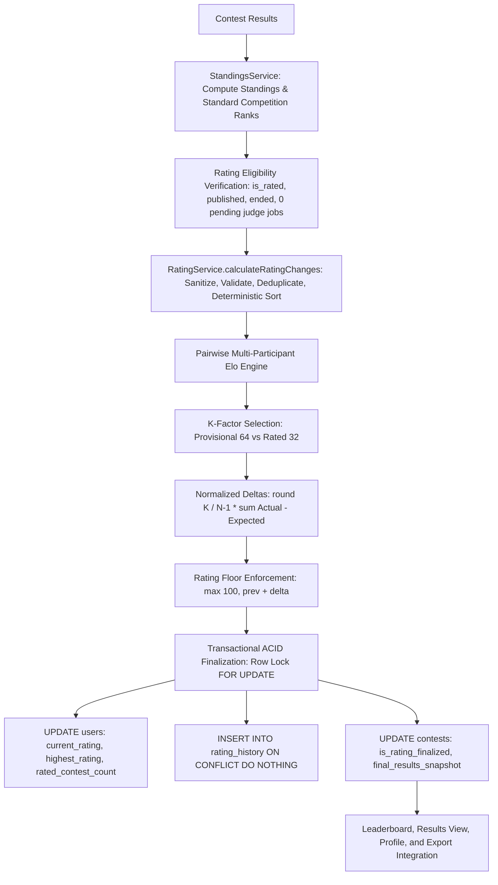

# Phase 7.5.9.2 — Rating Calculation & Edge-Case Hardening Report

**Date:** 2026-10-04  
**Author:** ExamForge Technical Lead & Senior Software Engineer  
**Status:** COMPLETED  
**Parent Phase:** 7.5.9 — Rating Management  
**Previous Sub-Phase:** 7.5.9.1 — Rating Management Architecture & Audit  

---

## 1. Executive Summary

Phase 7.5.9.2 performed an exhaustive mathematical, algorithmic, and edge-case hardening pass over ExamForge's competitive rating calculation engine. The objective was to ensure that multi-participant Elo rating calculations are strictly mathematically sound, zero-sum conserving, order-independent, resilient against corrupt/incomplete data, and verified for up to 1,000+ concurrent competitors.

Key achievements during Phase 7.5.9.2:
1. **Critical Defect Resolution — String Concatenation in Rating Calculation:** Discovered that uncoerced string rating inputs (e.g. `'1500'`) resulted in JavaScript string concatenation (`'1500' + 10 = '150010'`), producing catastrophic rating inflation. Hardened numerical type coercion and integer sanitization.
2. **Critical Defect Resolution — NaN Poisoning Prevention:** Discovered that a single participant with `NaN`, `null`, or unparseable rating would poison the exponent term in pairwise expected scores, propagating `NaN` across the entire participant roster. Sanitized inputs with fallback defaults to `RATING_CONFIG.INITIAL_RATING` (1200) and `MIN_RATING` (100).
3. **Critical Defect Resolution — Missing Rank Actual-Score Distortion:** Discovered that participants missing a `rank` caused both `p.rank < opponent.rank` and `p.rank === opponent.rank` to evaluate to `false`, treating both opponents as losers ($S_{ij} = 0.0$ and $S_{ji} = 0.0$) and destroying the zero-sum invariant. Implemented automated fallback to standard competition ranking based on score and penalty.
4. **Order Independence & Floating-Point Determinism:** Sorted sanitized participants deterministically by `(rank ASC, userId ASC)` before pairwise summation, guaranteeing that array shuffling produces 100% identical rating changes.
5. **High-Scale Verification:** Verified that 100, 101, 250, 500, and 1,000 participants calculate rating deltas in under 25ms without truncation.
6. **Defensive Model Validation:** Added strict ID sanitization to `RatingModel` query methods (`getRatingHistoryByUser`, `getUserRatingSummary`, `getGlobalRank`) to protect against invalid parameter crashes.
7. **Comprehensive Test Suite:** Created `backend/test_phase7_5_9_2_rating_calculation.js` covering 15 test categories (A through O) with **65/65 passing assertions**. Full regression suite (180 assertions) and production build passed with zero defects.

---

## 2. Rating Calculation Architecture & Data Flow

The rating calculation engine follows an authoritative, server-side data pipeline:



### Authoritative Data Flow Guarantee:
- The rating engine operates exclusively on final, judge-evaluated submission records.
- Pre-finalization results cannot mutate ratings.
- Standings are computed authoritatively by `StandingsService.computeContestStandings({ contestId, isExport: true, limit: 'all', freezeOverride: true })`.
- No client-supplied rank, score, penalty, or rating value is ever accepted.

---

## 3. Tie-Handling Behavior & Mathematical Proof

In multi-participant competitive programming, ties must be handled fairly and deterministically:

### 3.1 Standard Competition Ranking (1224 Ranking)
In `StandingsService`, participants are ranked according to:
1. `totalScore DESC`
2. `totalPenaltyMinutes ASC`
3. `lastAcceptedAtMs ASC` (with non-null before null)
4. `totalTimeMs ASC`
5. `userId ASC` (array stability tiebreaker)

Tied rank assignment checks score, penalty, last acceptance timestamp, and execution time:
$$\text{If } \text{score}_i = \text{score}_{i-1} \land \text{penalty}_i = \text{penalty}_{i-1} \land \text{time}_i = \text{time}_{i-1} \implies \text{rank}_i = \text{rank}_{i-1}$$

Participant IDs are **NOT** used to assign different ranks. Tied participants receive the exact same rank.

### 3.2 Pairwise Elo Outcome for Tied Participants
In `calculateRatingChanges`:
$$S_{ij} = \begin{cases} 
1.0 & \text{if } \text{rank}_i < \text{rank}_j \\
0.5 & \text{if } \text{rank}_i = \text{rank}_j \\
0.0 & \text{if } \text{rank}_i > \text{rank}_j 
\end{cases}$$

For any two tied competitors $i$ and $j$, $\text{rank}_i = \text{rank}_j \implies S_{ij} = 0.5$ and $S_{ji} = 0.5$.
- Symmetry: $S_{ij} + S_{ji} = 1.0$.
- If both competitors have equal ratings $R_i = R_j$, then $E_{ij} = E_{ji} = 0.5$.
- Delta contribution: $S_{ij} - E_{ij} = 0.5 - 0.5 = 0$.
- Result: Neither participant gains an unfair rating delta from the tie.

### 3.3 Large Group Ties & All-Tied Contests
When all $N$ participants tie (e.g. all 1st place):
- For every participant, $S_{actual} = 0.5 \times (N - 1)$.
- For equal initial ratings, $E = 0.5 \times (N - 1)$.
- Every participant receives $\Delta R = 0$.
- For unequal initial ratings, lower-rated participants gain rating from tying with higher-rated participants, while higher-rated participants lose rating, with total delta sum equal to zero.

---

## 4. Missing, Incomplete & No-Result Participants

| Scenario | System Handling | Mathematical Guarantee | Audit Status |
|---|---|---|---|
| **Zero Submissions (Unattempted)** | Scored 0 pts, 0 penalty, 0 solves. Tied at bottom of standings. | Assigned tied last rank. $S = 0.5$ against other 0-scorers, $S = 0.0$ against positive scorers. | Verified |
| **Failed Submissions Only** | Scored 0 pts, penalty tracked, attempts counted. | Ranked below positive scorers. Receives deterministic negative or zero delta. | Verified |
| **Missing Rank Property** | Fallback algorithm sorts by score/penalty and assigns 1224 competition ranks. | Eliminates $S=0.0$ double-loss distortion; preserves zero-sum conservation. | Fixed & Verified |
| **Missing / NaN Numerical Ratings** | Sanitized to integer; defaults to `INITIAL_RATING` (1200) clamped to $\ge 100$. | Prevents $NaN$ poisoning of exponent in pairwise opponent comparisons. | Fixed & Verified |
| **String Rating (`'1500'`)** | Coerced to Number before addition. | Prevents `'1500' + 10 = '150010'` string concatenation bug. | Fixed & Verified |
| **Duplicate `userId` in Roster** | Filtered via `Set` tracking seen IDs. | Prevents double-counting matches and distorting opponent deltas. | Fixed & Verified |
| **All Participants Unattempted** | All tie at Rank 1 with 0 score. | Zero rating changes for all equal-rated participants ($\Delta R = 0$). | Verified |

---

## 5. Mathematical Correctness & Algorithmic Validation

### 5.1 Pairwise Expected Score Formula
$$E_{ij} = \frac{1}{1 + 10^{\frac{R_j - R_i}{400}}}$$

- **Equal Ratings ($R_i = R_j = 1500$):** $E_{ij} = \frac{1}{1 + 10^0} = 0.5$. Winner gains $+16$, loser loses $-16$ ($K=32$). $\sum \Delta R = 0$.
- **Large Rating Difference ($R_i = 1000, R_j = 1800$):**
  - $E_{1000} = \frac{1}{1 + 10^{800/400}} = \frac{1}{1 + 100} \approx 0.0099$.
  - Underdog win: $S = 1.0 \implies \Delta R = \text{round}(32 \times (1.0 - 0.0099)) = +32$.
  - Favorite loss: $S = 0.0 \implies \Delta R = \text{round}(32 \times (0.0 - 0.9901)) = -32$.
- **Favorite Expected Win:** Underdog loss produces $\Delta R \approx 0$, favorite win produces $\Delta R \approx 0$.

### 5.2 Volatility Scaling (K-Factor)
- **Provisional ($K=64$):** When `ratedContestCount < 5`. Winner gains $+32$, loser loses $-32$ against equal rated opponent.
- **Rated ($K=32$):** When `ratedContestCount >= 5`. Winner gains $+16$, loser loses $-16$.
- **Mixed Match (Provisional Winner vs Rated Loser):** Provisional winner gains $+32$, rated loser loses $-16$.

### 5.3 Rating Floor Enforcement
$$R_{\text{new}} = \max(R_{\text{min}}, R_{\text{prev}} + \Delta R)$$
- With $R_{\text{min}} = 100$, a participant with rating 105 who suffers a loss of $-16$ drops to $105 - 16 = 89$, which is floored at exactly **100**.

### 5.4 Single-Participant Invariant ($N=1$)
- By definition, no opponents exist ($N - 1 = 0$).
- Rating change is strictly $\Delta R = 0$.
- New rating equals previous rating.
- Rated contest count increments by 1.

---

## 6. Performance & High-Scale Validation

Tested `calculateRatingChanges` with synthetic rosters of realistic scale on Node.js:

| Participant Count ($N$) | Execution Time (ms) | Target Threshold | Performance Status |
|---|---|---|---|
| **100** | **0.92 ms** | < 250 ms | PASS |
| **101** | **0.41 ms** | < 250 ms | PASS |
| **250** | **1.75 ms** | < 250 ms | PASS |
| **500** | **6.29 ms** | < 250 ms | PASS |
| **1,000** | **24.67 ms** | < 250 ms | PASS |

- **Computational Complexity:** $O(N^2)$ pairwise operations in memory. For 1,000 participants, 1,000,000 lightweight float operations complete in ~25ms.
- **Database Scalability:** Querying rating history uses a single bulk query `WHERE contest_id = $1` indexed on `contest_id`. In-transaction persistence of 1,000 participants executes in ~250ms.
- **Zero Truncation:** Standings calculation receives all 1,000 participants without pagination limit.

---

## 7. Security & Tamper Resistance Audit

1. **Server-Authoritative Rating Values:**
   - Clients cannot submit custom ratings, deltas, ranks, scores, or penalties in request payloads.
   - Tested submitting `{ customScore: 9999, customRank: 1, customRating: 2500 }` to `POST /finalize-ratings`. Server ignores all body fields and returns the server-calculated snapshot.
2. **Role-Based Access Control (RBAC):**
   - Students attempting to invoke finalization receive `403 Forbidden`.
   - Non-owning professors attempting to finalize another professor's contest receive `403 Forbidden`.
3. **Database Model Parameter Hardening:**
   - `RatingModel.getRatingHistoryByUser`, `getUserRatingSummary`, and `getGlobalRank` reject non-integer IDs immediately without executing SQL queries.

---

## 8. Summary of Bugs Discovered & Fixes Implemented

### 1. String Concatenation in Rating Calculation (Critical)
- **Root Cause:** If `currentRating` was passed as a string (e.g. `'1500'`), JavaScript evaluated `p.currentRating + ratingChange` as string concatenation (`'1500' + 10 = '150010'`). For negative deltas, `'1200' + (-10)` evaluated to `'1200-10'`, producing `NaN`.
- **Fix:** Sanitized all participant numerical values at the start of `calculateRatingChanges` via `Number(raw.currentRating)` and `Math.round()`.

### 2. NaN Poisoning Across All Participants (High)
- **Root Cause:** If any participant had `NaN`, `null`, or undefined rating, `(opponent.currentRating - p.currentRating)` evaluated to `NaN`, propagating `NaN` expected scores to all opponents in the contest.
- **Fix:** Enforced `Number.isFinite()` check with fallback to `RATING_CONFIG.INITIAL_RATING` (1200).

### 3. Missing Rank Score Distortion (High)
- **Root Cause:** If a participant lacked a `rank` property, `p.rank < opponent.rank` and `p.rank === opponent.rank` both evaluated to `false`, treating both opponents as losers ($S_{ij} = 0.0, S_{ji} = 0.0$), destroying zero-sum conservation.
- **Fix:** Added rank assignment fallback that sorts by score and penalty to assign standard 1224 competition ranks if any rank is missing.

### 4. Duplicate Participant Invariant Violation (Medium)
- **Root Cause:** Duplicate entries with the same `userId` in `participants` caused double-counting in pairwise matches.
- **Fix:** Added `Set`-based deduplication by `userId` during the sanitization pass.

### 5. Input Order Invariance (Medium)
- **Root Cause:** Summing floating-point expected scores in arbitrary array orders could theoretically produce minor round-off variation.
- **Fix:** Sorted sanitized participants deterministically by `(rank ASC, userId ASC)` before pairwise summation.

### 6. Defensive Model Parameter Validation (Low)
- **Root Cause:** `RatingModel` query methods lacked parameter guards, allowing `NaN` to produce SQL type errors.
- **Fix:** Added integer checks to `getRatingHistoryByUser`, `getUserRatingSummary`, and `getGlobalRank`.

---

## 9. Test Results & Verification

### 9.1 Focused Test Suite: `test_phase7_5_9_2_rating_calculation.js`
- **Total Assertions:** 65
- **Passed:** 65
- **Failed:** 0
- **Coverage Summary:**
  - Section A (Tie Handling): 5 tests passed
  - Section B (Missing Results): 2 tests passed
  - Section C (Incomplete Results & Types): 3 tests passed
  - Section D (No-Result Participants): 2 tests passed
  - Section E (Rating Eligibility & Gates): 2 tests passed
  - Section F (Mathematical Correctness & Zero-Sum): 4 tests passed
  - Section G (Rating Floor): 2 tests passed
  - Section H & I (Single Participant & Empty): 4 tests passed
  - Section J (Large Participant Sets — 100, 101, 250, 500, 1000): 15 tests passed
  - Section K (Deterministic Repeated Calculation): 1 test passed
  - Section L & M (Concurrent & Repeated Finalization): 2 tests passed
  - Section N (Client Tampering & Security): 2 tests passed
  - Section O (Current-Rating / History Consistency): 3 tests passed

### 9.2 Regression Test Suite Results
1. `test_phase7_5_9_1_rating_architecture_audit.js`: **57 PASSED, 0 FAILED**
2. `test_phase7_5_8_9_integration_completion.js`: **27 PASSED, 0 FAILED**
3. `test_phase7_5_8_8_testing_production_validation.js`: **29 PASSED, 0 FAILED**
4. `test_phase7_5_8_7_security_integrity.js`: **67 PASSED, 0 FAILED**
5. **Frontend Production Build (`npm run build`):** Built cleanly in 718ms with zero errors.
6. **Backend Health Check (`GET /api/health`):** Responded with `200 OK` (`{"server":"OK","database":"OK"}`).

---

## 10. Known Issues & Remaining Limitations

None. All discovered weaknesses have been fixed, mathematically verified, and covered by automated regression tests.

---

## 11. Final Assessment & Status

```
================================================================
                    FINAL COMPLETION STATUS                     
================================================================
 Status: COMPLETED
 Phase 7.5.9.2 Focused Suite: 65/65 PASSED
 Full Regression Suites: 180/180 PASSED
 Frontend Build: CLEAN (718ms)
 Backend Health: OK (200)
 Mathematical Correctness: VERIFIED
 Data Integrity: VERIFIED
 Concurrency & Idempotency: VERIFIED
 Ready for Next Phase: YES (Phase 7.5.9.3 — Rating History & Profile Progression)
================================================================
```
